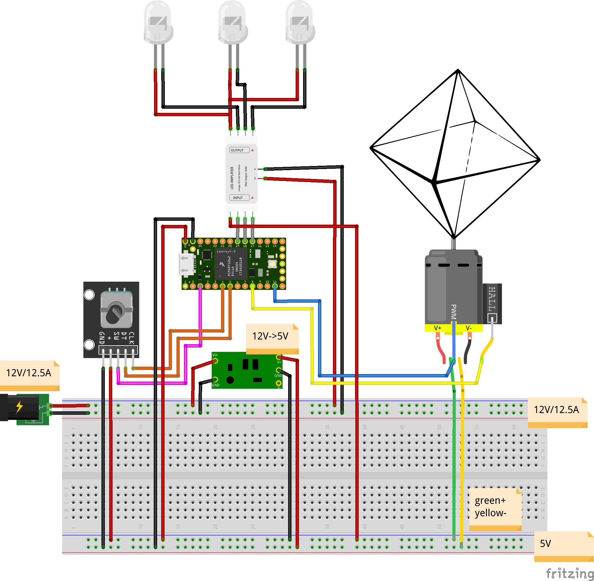

# Releases
Collection of releases for fast deployment.

## How-to
This section describes how to set up the project and get it to run the fast way.

1. Pick a release below.
2. Set-up the hardware according to the connection diagram of the release
3. Download the files in the releases `Drehdings/` folder
4. Open the `Drehdings.ino` with the Arduino IDE
5. Change the settings in the configuration section to match your set-up
6. Compile and upload to the microcontroller
7. Enjoy!

## Releases

### [2020-03-05 Absolute Zero](20200205AbsoluteZero/)
A set-up with three LEDs, a rotary encoder to control the motor speed, and a push button to loop through the effects. Does not support gear ratio. Only includes a small number of effects. Mainly intended to try the configuration.

**Usage:**
- LED1 and LED2 will create two slowly turning images of the objects turning in opposite directions.
- Turn knob of rotary encoder to start the motor and to control the motor speed.
- Use push button on rotary encoder to alternate the third LEDs point of flicker (from 0 to 45 degree and back)

**Diagram:**

## Create a new release

1. Make sure that the code is working well (testing)
2. Choose a name, all releases are named after [colours](https://en.wikipedia.org/wiki/Lists_of_colors)
3. Create a folder under `arduino/releases/` names `YYYYMMDDColour`
4. Copy the `main.cpp` and all library files (`.h` and `.cpp`) to a `Drehdings/` subdirectory
5. Rename `main.cpp` to `Drehdings.ino`
6. Open `Drehdings.ino` in Arduino IDE, compile, upload, and test
7. Create a hardware connection diagram with [Fritzing](https://fritzing.org/) and export as PNG/SVG to release folder
8. Create a new release section in this file and describe the release
