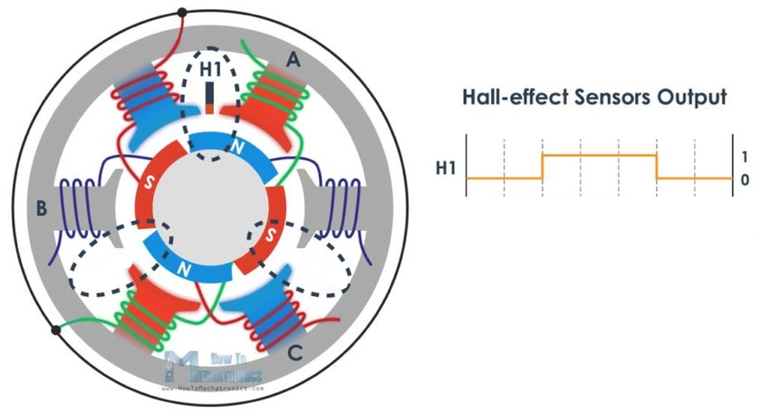

# Hardware

## The connection diagram


## The components

#### The microcontroller
The microcontroller lies at the core of the project. Here, all the input signal are gathered and the output signals send to the various components to ensure a seamless interaction. Any programmable microprocessor with digital and at least one analogue PIN can be employed. We use [Arduinos](www.arduino.cc) variants, specifically the [Teensy 4.0](https://www.pjrc.com/store/teensy40.html) for their size and simplicity.


#### The DC motor
The [DC motor](https://en.wikipedia.org/wiki/DC_motor) rotates the illuminated object. It should be powerful enough to drive it fitfully. And it should be of sufficient quality to minimize vibrations, as these weaken the stroboscopic effect. We also want to control the motor's rotation speed, which is usually realized through a [PWM](https://en.wikipedia.org/wiki/Pulse-width_modulation) input. Additionally, the motor should contain a speedometer, usually a hall sensor (see below for more details on this component). All of these controls are already included in modern fan motors, which are therefore our motors of choice.

A typical specification sheet of a fan motor can e.g. look as follows:


##### Power supply
Here the black and red wires. Arduino's can only supply 3V or 5V, hence you will need an additional power supply to drive the motor and the LEDs. Take care to keep the power lines separated: Supplying too high voltage to the Arduino or a voltage over 3V to one of the Arduino's input pins can destroy the processor. All ground wires should be connected to the same line, though.

##### Speedometer / hall sensor
Here the yellow wire. Analogue output that sends a PWM signal. See below for more details.

##### Rotation speed control
Here the blue wire. Analogue input that expects a PWM signal. This signal is then averaged, and [the average voltage received determines the motor's rotation speed](https://www.electronics-tutorials.ws/blog/pulse-width-modulation.html).

We employ a rotary encoder to control the motor speed.

##### Rotation direction control
Here the white wire. Digital input that expects a high or low signal. Depending on the signal, the motor turn clockwise (CW) or counter-clockwise (CCW). We do not make use of this wire.


#### The (incremental) rotary encoder
A [rotary encoder](https://en.wikipedia.org/wiki/Rotary_encoder) is essentially a turning knob. We can capture in which direction it turns and change a variable accordingly. A detailed description of it' working can be found [her](https://lastminuteengineers.com/rotary-encoder-arduino-tutorial/).

Here we use it to control the motor speed by changing the PWM signal's duty cycle.

Since the rotary encoders signal is not very clean, it cannot be used for discrete changing of states, as e.g. controlling the LED effects. Even with software de-bouncing activated.

Our rotary encoder (model KY-040) also incorporates a push button. See there for more details.


#### The hall sensor (build into the motor)
A hall sensor is a device to measure the magnitude of a magnetic field. To understand how the sensor works in this setup, we must first look at the DC motor's inner workings:


The *stator* is the stationary casing, the *rotor* the movable inner element. The former contains wire *windings*, the latter is covered with a number of *permanent magnets* with alternating polarity. When power is supplied, the wirings are switched on and off in order, creating a magnetic current that attracts or repels the permanent magnets depending on their polarity, and, ultimately, causes the rotor to turn. There are other types of DC motors, but they work similarly.

Now let's look at an equivalent schema, but with an hall sensor added:



The *hall sensor* (H1) is placed at a fixed position between two wirings in the stator. Every time a permanent magnet passes, it registers a change in the magnetic field. Or, more simple, when it has an N-polarity magnet in front of it, it creates an output. And when it has an S-polarity magnet in front of it, it does not create an output. When the motor is rotating, the permanent magnets pass continuously in front of the hall sensor, causing it to generate a PWM signal as can be seen on the right.

The generated PWM has a fixed-length duty cycle of 50% (aka it is on 50% of the signal time), since the permanent magnets are of equal length. It's frequency (rate), on the other hand, depends directly on the motor's rotation speed. That's why the signal can be utilized as a speedometer.

When connected to an input pin of the microcontroller, we will see a LOW->HIGH signal transition each time a N->S permanent magnet transition passes in front of the hall sensor. And a HIGH->LOW signal transition each time a S->N permanent magnet transition passes in front of the hall sensor (Not sure about the N->S, S->N order, though. But it doesn't matter for our application). These are usually captured with hardware interrupt signal in the microcontroller's code (more on this in the code section). Important is, that to know the rotation speed of the motor, we must know the number of permanent magnets it contains, as these determines the number of signals we will receive per motor rotation.

This value should be given in the motor specifications. If it is not supplied, you can find some code in the [tests/](tests/) folder to experimentally determining the number. Usual values are somewhere between four and 24 magnets. If you count only the LOW->HIGH or the HIGH->LOW transitions, you will receive exactly half the number of signals. If you count both, you will receive as many signals as there are permanent magnets.

Although unusual, some motors have e.g. 18 permanent magnets, which results in an uneven number of nine signals when counting only the LOW->HIGH transitions. In these cases it might be advantageous to count all transitions to achieve a signal number of 18, which is easier dividable.

##### Pull up resistor
The hall sensor must be connected to it's pin with a pull-up resistor set-up, as shown in the following image:


This is necessary, as the signal it produces is relatively unstable and of varying and (probably) unknown voltage. Furthermore, this causes a noise signal on the wire if the hall sensor is of (aka the motor not turning). Such a pull-up resistor set-up [can also be enabled on the microprocessor directly](https://www.arduino.cc/en/Tutorial/BuiltInExamples/InputPullupSerial), without the need of an external resistor and additional power supply. Simply set the chosen [digital input pin](https://www.arduino.cc/en/Tutorial/Foundations/DigitalPins) as follows:

```cpp
pinMode(PIN_HALL, INPUT_PULLUP);
```

Note that this will invert the HIGH and LOW signals.

##### Pin 13 or the LED pin
Most Arduino boards have one pin (usually 13) with a directly connected LED. This is a useful set-up to visually confirm that a signal arrives at the pin. But the hard-wired LED makes it a unsuitable choice for a pin in `INPUT_PULLUP` mode. Don't use this particular pin as input for the hall sensor.


#### The LEDs, with LED amplifier board
Since the LEDs require more power than the microcontroller can provide, they are not directly connected to it, but rather to an LED amplifier board. That way, an external power supply can drive the LEDs safely and reliably. The connection to the microcontroller's pin can be either a source or a sink. If pin is used as LED sink, you set the register of the pin to LOW to turn the LED on. And vice-versa.

For maximum effect variability, choose LEDs of different colours in different positions.

The pins should be digital. We put them OUTPUT mode and set to one level (HIGH or LOW) to switch the LED on. And to the other level to switch it off.


#### The (effect) push button
We employ a push button to loop through the different LED effects. In above diagram, this button is integrated in the rotary encoder, but a separate push button can be used just as easily.

Every time the button is pressed the LED's change their LED effects according to a pre-defined effect loop. Note that we employ software de-bouncing.


#### The power supply
The microcontroller itself can be supplied with power through the USB connection. If you want to run the set-up also separated from the PC, you will have to supply power from another source, too. Since both, the motor and the LEDs, are ideally also supplied by an external power supply, you can supply all components together, as long as their requirements match.

The LEDs and the motor run at 12V. The microcontroller is supplied with 5V. The rotary encoder requires 3-5V. And all PINs deliver ad consumer 3V.

Note that all sinks should be connected, even if multiple power sources are used.

See the schemas in the project variants below for the exact set-up.

#### The rotating object
The object can be anything. Depending on its shape, you can achieve different stroboscopic effects. Typical choices are 3D geometrical shapes, such as cubes, octahedrons, tetrahedrons, etc. But you can also mount a 3D printed anime figurine on the motor, if you wish.


## Hardware variants

### Hardware variant I (Oskar's small setup)

- microcontroller is Teensy 4.0, Arduino compatible (see [her](https://www.pjrc.com/store/teensy40.html) for PIN specifications)
- [motor specifications](https://ae01.alicdn.com/kf/HTB1I91_IpXXXXb9XpXXq6xXFXXXc/221879944/HTB1I91_IpXXXXb9XpXXq6xXFXXXc.jpg)
	- Note that no FG singal is described here. In the specs of the bigger motor (https://ae01.alicdn.com/kf/H9b7d23087b9f4301bd53cda0bcdb2bbfT.jpg) it is.
	- The smaller nevertheless does have a tacho that sends a signal on the yellow cable (we measured it)
	- Experimentation revealed: hall sensor has 9 LOW->HIGH signal per rotation, that means 18 if also HIGH->LOW is measured
- LEDs
	- A HIGH signal switches them off, a LOW switches them on!
	- The fastest still visible flash (on time interval) is 100 microseconds aka 0.1 milliseconds


### Hardware variant II (Chris' large setup)

- [motor specifications](https://ae01.alicdn.com/kf/H9b7d23087b9f4301bd53cda0bcdb2bbfT.jpg)
