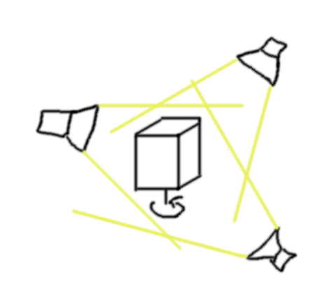

# Dreh Ding
An optical illusion.

- [platformio/](platformio/) - the project's code; developed with [platform.io](https://platformio.org/) framework
- [arduinoide/](arduinoide/) - code for the Arduino IDE
	- [tests/](arduinoide/tests/) - component tests, mainly for debugging purposes
	- [legacy/](arduinoide/legacy/) - legacy code, kept to look up old coding patterns
	- [sandbox/](arduinoide/sandbox/) - various code snippets in various states
- [ui/](ui/) - python template code to communicate with the microcontroller
- [fritzing/](fritzing/) - hardware connection diagrams and components created with [Fritzing](https://fritzing.org/)
- [images/](images/) - images for the readme

### Documentation
- [flasheffects.md](flasheffects.md) - A collection of different flash effects that could be programmed.
- [exhibition.md](exhibition.md) - Collection of ideas for installations and performances based on the project.
- [notes.md](notes.md) - Various notes and remarks which have no better place.
- [ideas.md](ideas.md) - Random ideas and notes and such. Can be deleted at any time.

## The project
**Dreh Dings** develops around the [stroboscopic effect](https://en.wikipedia.org/wiki/Stroboscopic_effect). The idea is to place a rotating geometrical object (e.g. a cube) in the centre of a stage and light it at specific intervals with flashes from a number of surrounding LED lights. By varying the flash intervals, various optical illusion effects can be generated. See the following images for a high level schema:

The project is realized through a number of hardware components and a microprocessor for controlling. Basically, the object turns on a motor whose speed we can modulate. The motor additionally contains a hall sensor (speedometer, clock) to measure the rotation speed. The hall sensor's signal is then used to flash the LEDs at the desired intervals.

The most simple flash configuration is be to flash a single LED always at exactly the same fraction of the object's rotation. Since the object is only illuminated when in the same position, it appears stationary to the observer.

More advanced and interesting flash configurations are also possible.

## Set-up
This section describes how to set up the project and get it to run the fast way.

1. Navigate to [arduinoide/releases/](arduinoide/releases/) and pick one.
2. Set-up the hardware according to the connection diagram of the release
3. Download the files in the releases `src/` folder
4. Open the `Drehdings.ino` with the Arduino IDE
5. Change the settings in the configuration section to match your set-up
6. Compile and upload to the microcontroller
7. Enjoy!

## The software
Coding is done with the [platform.io](https://platformio.org/) framework. Ideally integrated into VSCode as IDE. For every release, an Arduino IDE compatible source code folder is also created.

## The hardware
See [hardware.md](hardware.md).